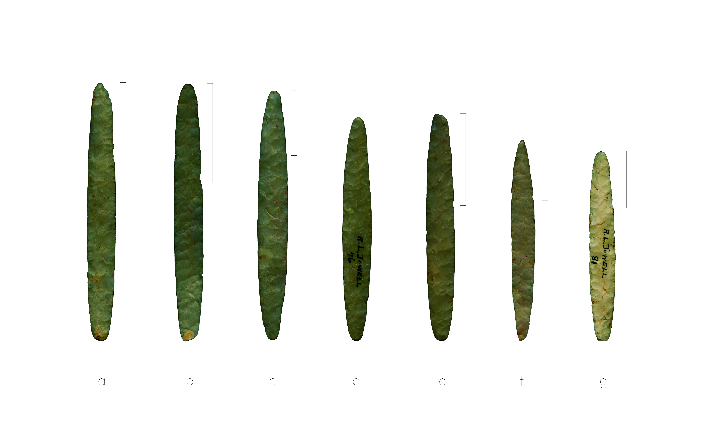

--- 
title: "Caddo retouch results in divergent morphology for elliptical bifaces from sites in the American Southeast"
author:
    - Robert Z. Selden, Jr.^[Heritage Research Center, Stephen F. Austin State University; Department of Biology, Stephen F. Austin State University; and Cultural Heritage Department, Jean Monnet University, zselden@sfasu.edu] and John E. Dockall^[Stantec, Inc.]
date: "`r Sys.Date()`"
site: bookdown::bookdown_site
documentclass: book
bibliography: [book.bib, packages.bib]
biblio-style: apalike
link-citations: yes
description: "Pilot study of biface morphology."
---

# Preface {-}

>Reproducibility---the ability to recompute results---and replicability---the chances other experimenters will achieve a consistent result---are two foundational characteristics of successful scientific research [@RN20918].

Elliptical bifaces from the Millsap Cache and Jowell Farm (41AN13) sites comprise two of the largest samples of this ill-understood lithic tool from the ancestral Caddo area. Similar to Gahagan bifaces, the bifaces from Jowell Farm are assumed to have been manufactured using Edwards chert---due to their size, the colours that they fluoresce beneath low and high frequency UV light, and the paucity of similarly large locally-available raw material sources---and acquired by the Caddo through trade with central Texas groups. Bifaces from the Millsap Cache are thought to have been manufactured from Kay County flint, providing for an empirical assessment of whether elliptical biface morphology differs as a function of raw material and/or biogeographical range. The sample from each site was subsequently divided into two size classes; one reflective of initial production/manufacture (larger), and the other associated with resharpening and/or retouch (smaller). Size classes were used to assess whether modifications by Caddo knappers may have yielded a similar---convergent---knife shape at the smaller size class, and to test the hypothesis that greater morphological variation would be apparent in that size class due to wear associated with regular use, paired with variable idiosyncracies related to resharpening and/or retouch. Results demonstrate that elliptical biface shape does not differ by raw material, but size does. This finding is suggestive of a shared mental template, but a size differential that is potentially driven by raw material and/or biogeographical differences. Additionally, elliptical biface size associated with the large size class does not differ between sites/raw materials; however, the small size class does. This finding aids in advancing the argument that elliptical biface morphology diverges through the resharpening trajectory, where bifaces from each site/raw material enter their uselife at a similar shape and size, but diverge significantly in size---but not shape---throughout that uselife. In following with our expectations, greater shape diversity occurred in the small size class, where the bifaces from Jowell Farm were found to be more diverse than those from Millsap Cache. Discrete biogeographical ranges and raw material differences are posited as the drivers of these extant morphological differences found in elliptical bifaces from the ancestral Caddo area.

```{r figmap, fig.cap="Geological map illustrating the location of the Millsap Cache and Jowell Farm, the level three ecoregions of the Arkansas Valley (blue), Ouachita Mountains (yellow), South Central Plains (orange), and ancestral Caddo area boundary (white) in the American Southeast."}

knitr::include_graphics('./images/map.png')
```

## Analysis overview

Prior to landmarking, elliptical bifaces were oriented with the most heavily retouched edge at top right (Figure \@ref(fig:figlm)). The landmarking protocol uses three landmarks; two horizontal tangents (top/bottom), and one placed at the furthest extent of the area that includes the heaviest amount of retouch; all were applied using the `StereoMorph` package [@RN8973]. Some bifaces include multiple areas of heavy retouch at the top and bottom of the same lateral edge (Figure \@ref(fig:figlm): b, c, d, and e), while others (Figure \@ref(fig:figlm): f) include one retouched edge at top right and another at bottom left. 

```{r figlm, fig.cap="Selected elliptical bifaces from the Jowell Farm site, highlighting the most heavily retouched area identified using a modified version of the approach developed and advanced by Miller [-@RN11459], Smallwood [-@RN8310], and Miller and Smallwood [-@RN11460]."}


```

To identify which edge was most heavily retouched, we employed a modified approach to the flaking index initially developed by Miller [-@RN11459], and later advanced and refined by Smallwood [-@RN8310], then Miller and Smallwood [-@RN11460]. The modified approach uses counts of flake scars from each edge in the two most heavily worked areas, paired with a measure of edge length (not linear/includes curvature). The number of flake scars was subsequently divided by the length of the worked edge, with the heaviest worked area identified by the greater value. 

The pattern that emerged suggested that the longest reworked edge on the elliptical bifaces was always more heavily retouched. This finding was used to incorporate the images of elliptical bifaces from the Millsap Cache [@RN11461], where the longest reworked edges were oriented to the top right prior to landmarking.

### Generalised Procrustes Analysis

Landmark data were subsequently aligned to a global coordinate system [@RN11622;@RN11623;@RN11563], achieved through generalized Procrustes superimposition [@RN478] performed in R 4.2.1 [@R] using the `geomorph` library v. 4.0.4 [@RN11530;@RN1774;@RN9565]. Procrustes superimposition translates, scales, and rotates the coordinate data to allow for comparisons among objects [@RN11564;@RN478]. The `geomorph` package uses a partial Procrustes superimposition that projects the aligned specimens into tangent space subsequent to alignment in preparation for the use of multivariate methods that assume linear space [@RN1646;@RN11563]. 

### Principal Components Analysis

Principal components analysis [@RN1746] was used to visualise shape variation among the elliptical bifaces. The shape changes described by each principal axis are commonly visualized using thin-plate spline warping of a reference image or 3D mesh [@RN1731;@RN479].

```{r figjowellpca, fig.cap="PCA of shape variables for elogated ovate bifaces."}
knitr::include_graphics('./images/pca.png')
```

### Procrustes ANOVA

To assess whether shape and size differed by `raw material` and `size class`, Procrustes ANOVAs [@RN1749] were run that enlist effect-sizes (zscores) computed as standard deviates of the generated sampling distributions [@RN1756]. A residual randomization permutation procedure (RRPP; n = 10,000 permutations) was used for all Procrustes ANOVAs [@RN1655;@RN11775], which has higher statistical power and a greater ability to identify patterns in the data should they be present [@RN1719].

### Morphological disparity

An analysis of morphological disparity was used [@RN11107;@RN7041;@RN5694] to identify potential differences in morphological diversity between size classes.

## Primary findings

  -   Bifaces _do not differ_ in shape, but **differ significantly** in size by raw material/biogeography.
  -   Bifaces in the _large size class_ recovered from the Millsap Cache and Jowell Farm do not differ in shape or size. This suggests consistent morphology in bifaces from the _large size class_, in support of production-based standardization.
  -   Bifaces in the _small size class_ recovered from the Millsap Cache and Jowell Farm **differ significantly** in size. Thus, while shape remains consistent, size differs, suggesting---at minimum---locally divergent approaches to retouch and/or resharpening.
  -   Morphological disparity in the shape of the _small size class_ is **significantly greater** at the Jowell Farm site, providing evidence for a more standardized approach to resharpening and/or retouch at the Millsap Cache site. That finding also supports the hypothesis that greater diversity in shape is associated with retouch and/or resharpening, rather than production/manufacture.

### Summary

The shape of elliptical bifaces does not differ significantly in either size class; however, size does. Results of the Procrustes ANOVA support the hypothesis for divergent morphology. The analysis of morphological disparity yielded support for the interpretation that greater morphological diversity is associated with resharpening and/or retouch, while providing additional support for morphological consistency in production/manufacture. 

## Acknowledgments

Our thanks to the Caddo Nation of Oklahoma, the Caddo Nation Tribal Council, Tribal Chairman, and Tribal Historic Preservation Office for permission and access to NAGPRA and previously repatriated collections. Our gratitude is also extended to Marybeth Tomka and Lauren Bussiere at the Texas Archeological Research Laboratory for their assistance with access to the bifaces and the associated records, and to Scott Hammerstedt and Debra K. Green at the Oklahoma Archeological Survey for their assistance with records requests. Thanks also to John Harman for access to the DStretch plugin for ImageJ that was useful in the analysis of flake scars, and to Harry J. Shafer, Hiram F. (Pete) Gregory, Christian S. Hoggard, and David K. Thulman for their comments and constructive criticisms on the ongoing analyses of Caddo biface morphology, and to Emma Sherratt, Kersten Bergstrom, Dean C. Adams, and Michael L. Collyer for their constructive criticisms, general comments, and suggestions throughout the development of this research program.

## Funding

Components of this analytical work flow were developed and funded by a Preservation Technology and Training grant (P14AP00138) to RZS from the National Center for Preservation Technology and Training (NCPTT), and additional grants to RZS from the Caddo Nation of Oklahoma, National Forests and Grasslands in Texas (15-PA-11081300-033) and the United States Forest Service (20-PA-11081300-074). Funding to analyse the bifaces from the Millsap Cache and Jowell Farm was provided by the Heritage Research Center at Stephen F. Austin State University.

## Data management

The analysis code associated with this project can be accessed through this document, is available in the GitHub repository, and digitally curated on the Open Science Framework. The reproducible nature of this enterprise provides a means for others to critically assess and evaluate the various analytical components [@RN20915;@RN20916;@RN20917], which is a necessary requirement for the production of reliable knowledge.

Reproducibility projects in [psychology](https://osf.io/ezcuj/) and [cancer biology](https://www.cos.io/rpcb) are impacting current research practices across all domains. Examples of reproducible research are becoming more abundant in archaeology [@RN20804;@RN21009;@RN11783;@RN21001;@RN9364], and the next generation of archaeologists are learning those tools and methods needed to reproduce and/or replicate research results [@RN21007]. Reproducible and replicable research work flows are often employed at the highest levels of humanities-based inquiries to mitigate concern or doubt regarding proper execution, and is of particular import should the results have---explicitly or implicitly---a major impact on scientific progress [@RN21008].

## Colophon

This version of the analysis was generated on `r Sys.time()` using the following computational environment and dependencies: 

```{r colophon, cache = FALSE}
# what R packages and versions were used?
if ("devtools" %in% installed.packages()) devtools::session_info()
```

Current Git commit details are:

```{r}
# where can I find this commit? 
if ("git2r" %in% installed.packages() & git2r::in_repository(path = ".")) git2r::repository(here::here())  
```
