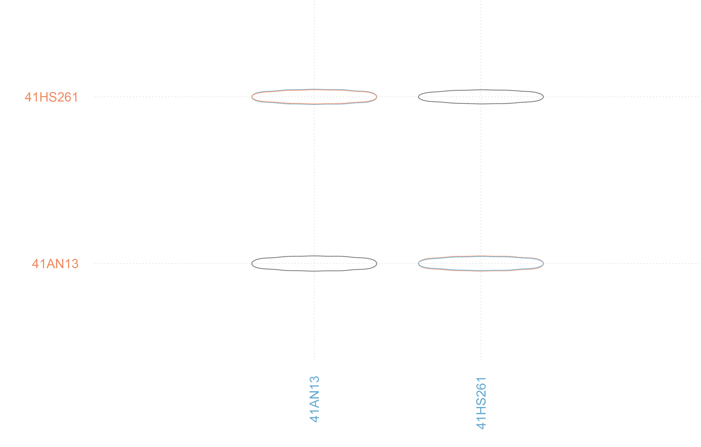

--- 
title: "A quantitative assessment of Jowell knife morphology"
author: 
    - Robert Z. Selden, Jr.^[Heritage Research Center, Stephen F. Austin State University; Department of Biology, Stephen F. Austin State University; and Cultural Heritage Department, Jean Monnet University, zselden@sfasu.edu]
date: "`r Sys.Date()`"
site: bookdown::bookdown_site
documentclass: book
bibliography: [book.bib, packages.bib]
biblio-style: apalike
link-citations: yes
description: "Pilot study of Jowell knife morphology."
---

# Preface {-}

>Reproducibility---the ability to recompute results---and replicability---the chances other experimenters will achieve a consistent result---are two foundational characteristics of successful scientific research [@RN20918].

```{r figjowellmorph, fig.cap="Jowell knives from Jowell Farm (41AN13) and 41HS261."}
knitr::include_graphics('./images/jowell.illustration.jpg')
```

## Primary findings

### Linear metrics

 - Jowell knives from 41HS261 are **significantly thicker** than those from 41AN13.
 
```{r figjowellbox, fig.cap="Boxplots for linear measurements associated with Jowell knives from 41AN13 and 41HS261."}
knitr::include_graphics('./images/boxplot.png')
```
 
### Geometric morphometrics

 - Jowell knives recovered at 41AN13 **differ significantly in shape** (are broader) from those recovered at 41HS261.
 
```{r figjowellpca, fig.cap="PCA for shape variables associated with Jowell knives from 41AN13 and 41HS261."}
knitr::include_graphics('./images/pca.png')
```

```{r figjowellmshape, fig.cap="Mean shapes for Jowell knives from 41AN13 and 41HS261."}

```
## Acknowledgments

Linear data and images of the Jowell knives were provided by Julian A. Sitters and Timothy K. Perttula. Many thanks to the Gregg County Historical Museum and the Texas Archeological Research Laboratory at The University of Texas at Austin for the requisite permissions and access associated with data collection.

## Funding {-}

Components of this analytical work flow were developed and funded by a Preservation Technology and Training grant (P14AP00138) to RZS from the National Center for Preservation Technology and Training (NCPTT), and additional grants to RZS from the Caddo Tribe of Oklahoma, National Forests and Grasslands in Texas (15-PA-11081300-033) and the United States Forest Service (20-PA-11081300-074). Funding to analyze the Jowell knives from 41AN13 and 41HS261 was provided by the Heritage Research Center at Stephen F. Austin State University.

## Data management

The analysis code associated with this project can be accessed through this document or the [GitHub](https://github.com/seldenlab/jowell) repository, which is digitally curated on the Open Science Framework [DOI: 10.17605/OSF.IO/CS436](https://osf.io/cs436/). The reproducible nature of this enterprise provides a means for others to critically assess and evaluate the various analytical components [@RN20915;@RN20916;@RN20917], which is a necessary requirement for the production of reliable knowledge.

Reproducibility projects in [psychology](https://osf.io/ezcuj/) and [cancer biology](https://www.cos.io/rpcb) are impacting current research practices across all domains. Examples of reproducible research are becoming more abundant in archaeology [@RN20804;@RN21009;@RN11783;@RN21001;@RN9364], and the next generation of archaeologists are learning those tools and methods needed to reproduce and/or replicate research results [@RN21007]. Reproducible and replicable research work flows are often employed at the highest levels of humanities-based inquiries to mitigate concern or doubt regarding proper execution, and is of particular import should the results have---explicitly or implicitly---a major impact on scientific progress [@RN21008].

## Colophon

This version of the analysis was generated on `r Sys.time()` using the following computational environment and dependencies: 

```{r colophon, cache = FALSE}
# what R packages and versions were used?
if ("devtools" %in% installed.packages()) devtools::session_info()
```

Current Git commit details are:

```{r}
# where can I find this commit? 
if ("git2r" %in% installed.packages() & git2r::in_repository(path = ".")) git2r::repository(here::here())  
```
