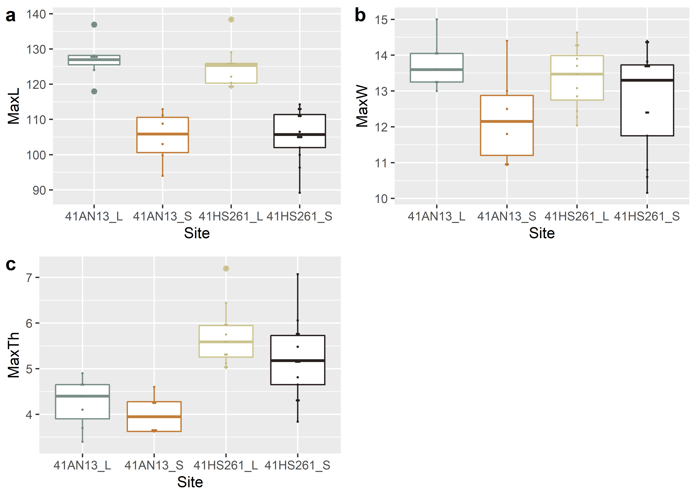
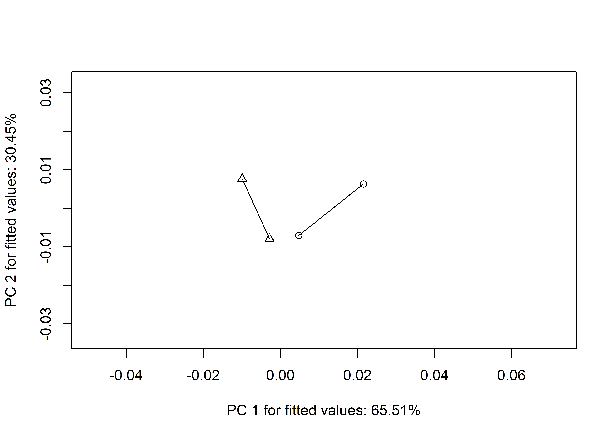

--- 
title: "Local Caddo resharpening practices result in convergent morphologies for Jowell knives from 41AN13 and 41HS261"
author: 
    - Robert Z. Selden, Jr.^[Heritage Research Center, Stephen F. Austin State University; Department of Biology, Stephen F. Austin State University; and Cultural Heritage Department, Jean Monnet University, zselden@sfasu.edu]
date: "`r Sys.Date()`"
site: bookdown::bookdown_site
documentclass: book
bibliography: [book.bib, packages.bib]
biblio-style: apalike
link-citations: yes
description: "Pilot study of Jowell knife morphology."
---

# Preface {-}

>Reproducibility---the ability to recompute results---and replicability---the chances other experimenters will achieve a consistent result---are two foundational characteristics of successful scientific research [@RN20918].

Jowell knives from 41AN13 and 41HS261 comprise the two largest samples of the type from the ancestral Caddo area. All were manufactured using Edwards chert, and are thought to have been acquired by the Caddo through trade with central Texas groups. The sample from each site was subset into two groups to reflect original manufacture (larger size), and local Caddo resharpening efforts (smaller size). These categories were used to assess whether local Caddo resharpening practices resulted in similar---convergent---shapes at their smaller size. It was also hypothesized that greater shape variation would be apparent at their larger size due to the influence of Caddo selective preference and non-local manufacture. Results of the analysis of linear variables demonstrated that large and small Jowell knives differ in thickness between both sites, where those from 41HS261 are thicker in both instances, suggesting local preference for thicker knives. The geometric morphometric analysis demonstrated that while the shape of Jowell knives from the large size class differed between sites, the small size class did not, supporting the argument for convergent shape change associated with local Caddo retouch or resharpening. The analysis of morphological disparity provides support for the argument that greater diversity in Jowell knife shape occurs in the larger size class at 41AN13, suggesting that greater shape variability is associated with Caddo selective preference, which subsequently becomes more standardized through local retouch or resharpening efforts.

```{r figjowellmorph, fig.cap="Illustration of Jowell knives from 41AN13 and 41HS261, ordered by length."}
knitr::include_graphics('./images/jowell.illustration.png')
```

## Primary findings

### Linear metrics

 -    Large and small Jowell knives from 41AN13 **differ significantly** in length, which was expected due to how the sample was parsed
 -    Large and small Jowell knives from 41HS261 **differ significantly** in length, which was expected due to how the sample was parsed
 -    Large Jowell knives from 41AN13 and 41HS261 **differ significantly** in thickness
 -    Small Jowell knives from 41AN13 and 41HS261 **differ significantly** in thickness

```{r figjowellpcalinear, fig.cap="PCA of linear measures for Jowell knives from 41AN13_L/S and 41HS261_L/S."}

```

```{r figjowellbox, fig.cap="Boxplots for linear measurements associated with Jowell knives from 41AN13 and 41HS261."}

```

### Geometric morphometrics

  -   Jowell knives recovered at 41AN13 and 41HS261 **differ significantly in shape** at their larger size, but not at their smaller size
  -   Results of the trajectory analysis _were not significant_, demonstrating convergent morphology
  -   Morphological disparity is **significantly greater** in the large size class at 41AN13

```{r figjowellpca, fig.cap="PCA of shape variables for Jowell knives from 41AN13_L/S and 41HS261_L/S."}
knitr::include_graphics('./images/pca.png')
```

```{r figjowellmshape, fig.cap="Resharpening trajectories do not differ, and illustrate convergent morphology (larger-to-smaller) for Jowell knives."}

```

## Acknowledgments

My thanks to the Caddo Nation of Oklahoma, the Caddo Nation Tribal Council, Tribal Chairman, and Tribal Historic Preservation Office for permission and access to NAGPRA and previously repatriated collections. My gratitude is also extended to Julian A. Sitters and Timothy K. Perttula for providing the linear measurements and images from their documentation effort. Thanks to John Harman for access to the DStretch plugin for ImageJ, to Harry J. Shafer, Hiram F. (Pete) Gregory, Christian S. Hoggard, and David K. Thulman for their comments and constructive criticisms on the analyses of Caddo biface morphology, and to Emma Sherratt, Kersten Bergstrom, Dean C. Adams, and Michael L. Collyer for their constructive criticisms, general comments, and suggestions throughout the development of this research program.

## Funding

Components of this analytical work flow were developed and funded by a Preservation Technology and Training grant (P14AP00138) to RZS from the National Center for Preservation Technology and Training (NCPTT), and additional grants to RZS from the Caddo Nation of Oklahoma, National Forests and Grasslands in Texas (15-PA-11081300-033) and the United States Forest Service (20-PA-11081300-074). Funding to analyse the Jowell knives from 41AN13 and 41HS261 was provided by the Heritage Research Center at Stephen F. Austin State University.

## Data management

The analysis code associated with this project can be accessed through this document. The reproducible nature of this enterprise provides a means for others to critically assess and evaluate the various analytical components [@RN20915;@RN20916;@RN20917], which is a necessary requirement for the production of reliable knowledge.

Reproducibility projects in [psychology](https://osf.io/ezcuj/) and [cancer biology](https://www.cos.io/rpcb) are impacting current research practices across all domains. Examples of reproducible research are becoming more abundant in archaeology [@RN20804;@RN21009;@RN11783;@RN21001;@RN9364], and the next generation of archaeologists are learning those tools and methods needed to reproduce and/or replicate research results [@RN21007]. Reproducible and replicable research work flows are often employed at the highest levels of humanities-based inquiries to mitigate concern or doubt regarding proper execution, and is of particular import should the results have---explicitly or implicitly---a major impact on scientific progress [@RN21008].

## Colophon

This version of the analysis was generated on `r Sys.time()` using the following computational environment and dependencies: 

```{r colophon, cache = FALSE}
# what R packages and versions were used?
if ("devtools" %in% installed.packages()) devtools::session_info()
```

Current Git commit details are:

```{r}
# where can I find this commit? 
if ("git2r" %in% installed.packages() & git2r::in_repository(path = ".")) git2r::repository(here::here())  
```
